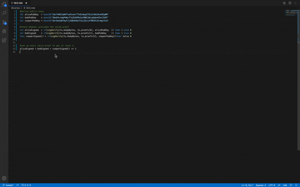
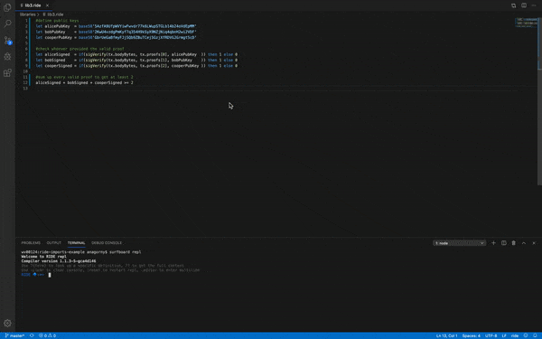
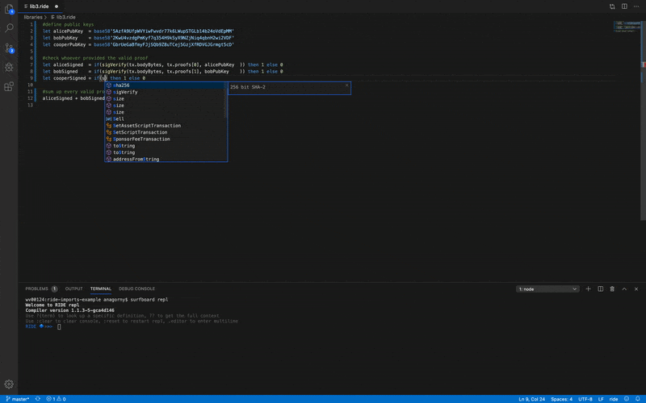
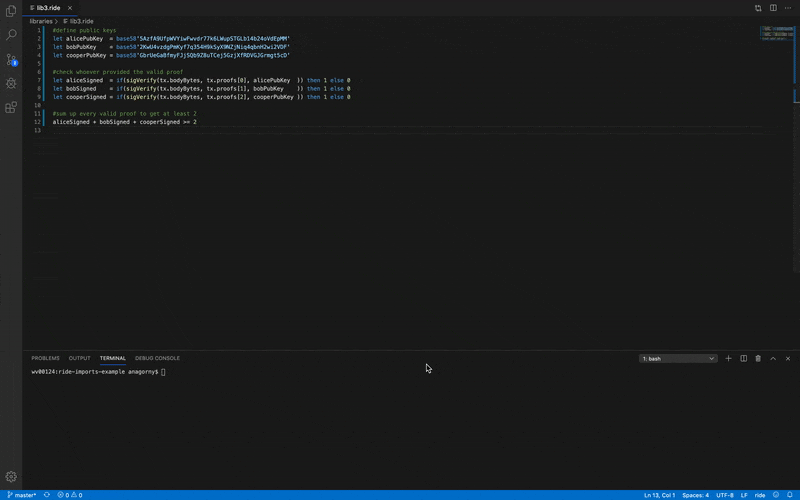
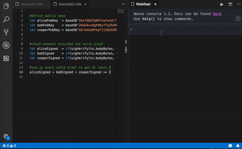
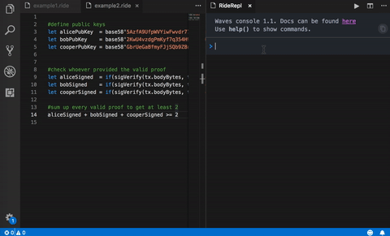
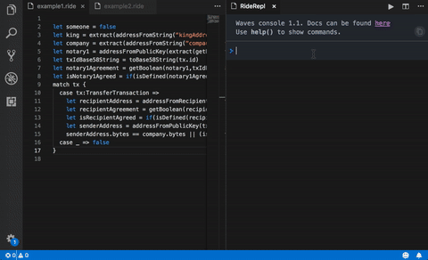

# Waves Ride language extention and REPL for Visual Studio Code
## Ride compiler version 1.1.2-15-gd668071

Ride is the language used in Waves blockchain to create smart accounts. This extention provides:
* Syntax highlighting
* Code completion for global functions and fields
* Snippets
* Interactive console console for Waves blockchain

# Usage

Extention recognizes ".ride" files

## Code completion
Use standard Ctrl/Command + Space to autocomplete. Global functions, variables, transaction types are supported. Pattern
matching and if/else statements supported via snippets
### 

## Go To Declaration
Go To Declaration is a feature that allows you to jump to the declaration of a variable or procedure. This can be done by placing the mouse over the name you want to see the declaration for, push control or command(on macOS) and left click
### 

## Hover
Show documentation on hover
### 

## Signature help
Signature help. When you open the (while calling a function, a pop-up provides signature help for the function. As you keep typing the parameters, the hint (underline) moves to the next parameter. Tip: Use ⇧⌘Space (Windows, Linux Ctrl+Shift+Space) to manually trigger the signature help when the cursor is inside the in the function call.### 
### 

## Error highlighting
Currently shows first compilation error. Invalid base64 and base58 strings are highlighted via syntax highlighting
### 

## Surfboard repl
Surfboard is distributed as npm package. To install run `npm i -g @waves/surfboard`
To open ride repl run  "surfboard repl" in your terminal.
Waves Repl is a javascript console with convenient functions to interact with blockchain.
Console provides help method for this functions. 
### 

#### Available functions
##### Transactions:
You can create and sign transactions.  All functions take transaction parameters and optional seed to sign.
If no seed is provided, default one from settings will be used. For more detailed list check [@waves/waves-transactions](https://wavesplatform.github.io/waves-transactions/) library, that is used internally

* alias(txParams, seed?) - create and sign createAlias transaction
* issue(txParams, seed?) - create and sign issue transaction
* reissue(txParams, seed?) - create and sign reissue transaction
* lease(txParams, seed?) - create and sign lease transaction
* cancelLease(txParams, seed?) - create and sign cancelLease transaction
* burn(txParams, seed?) - create and sign burn transaction
* transfer(txParams, seed?) - create and sign transfer transaction
* massTransfer(txParams, seed?) - create and sign massTransfer transaction
* setScript(txParams, seed?) - create and sign setScript transaction
* data(txParams, seed?) - create and sign data transaction
### 

##### Addresses and keys:
You can generate keyPairs from seed. If no seed is provided, default one from settings will be used.
* keyPair(seed?) - create key pair. Both private and public
* privateKey(seed?) - create private key
* publicKey(seed?) - create public key
* address(seed?) - create address from seed
### 

##### Code interaction:
You can interact with code.
* contract() - retrieves text from current active editor with .ride file
* file(fileName) - retrieves text from open editor with .ride file by file name
* compile(text) - compiles contract code
### 

##### Blockchain interaction:
You can broadcast transaction to blockchain or publish current script
* broadcast(tx, apiBase?) - send transaction to waves node
* deploy() - shortcut to broadcast(setScript({script:compile(contract())}))

#### Settings
Default chain id
```
"rideExtention.repl.CHAIN_ID": "T"
```
Default seed
```
"rideExtention.repl.SEED": "our default example seed for ride extention plugin inside visual studio code"
```
Node URL
```
"rideExtention.repl.API_BASE": "https://testnodes.wavesnodes.com"
```
